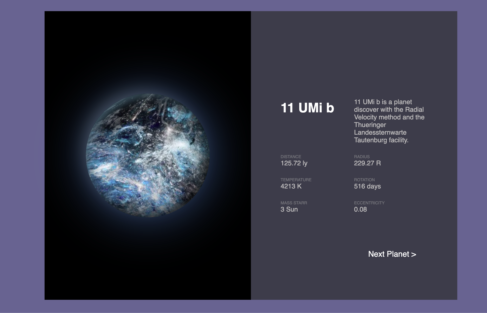

## Stack of this project

`Next.js` / `Node.js`

## Objective of the project

Compare build and on-page performances of :

- `Next.js` / `Node.js` -> current project
- [Next.js / Bun.sh : link](https://github.com/AdrianGuery/NextJS-Bun.sh-Exoplanet)
- `Gatsby.js` / `Node.js`

You will find the other projects on [my github](https://github.com/AdrianGuery).

## The results

🚧 Work in progress... 🚧

## The project

More than 5000 pages with details informations about exoplanet.

Datasource : https://exoplanetarchive.ipac.caltech.edu/
Design inspiration : https://dribbble.com/shots/11271564-Planestate-Website-Interaction-Concept
